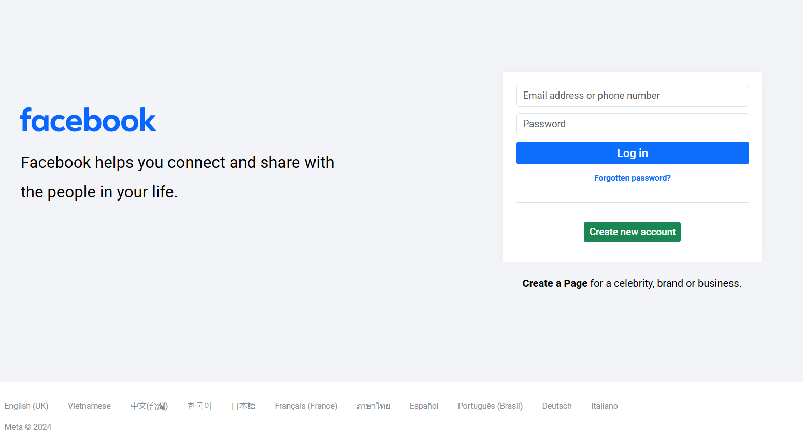
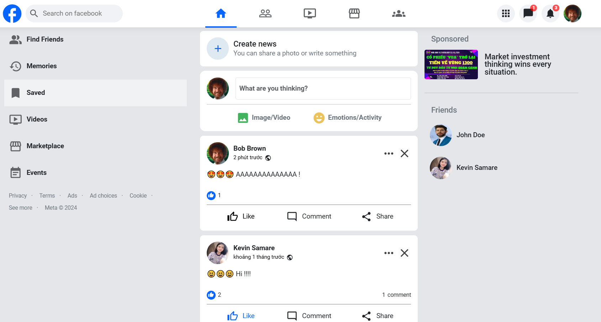
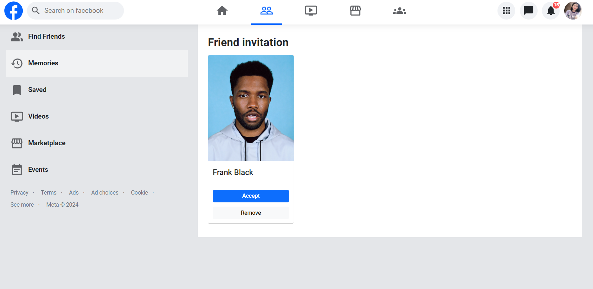
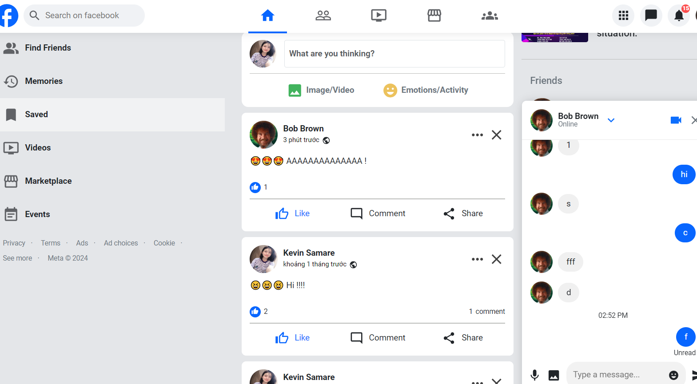

# FACEBOOK

## Overview

The Facebook Clone Frontend project is a web-based application built to replicate the essential features of Facebook's user interface and functionalities. Developed using modern frontend technologies, this project enables users to interact in a social media environment by posting content, adding friends, commenting, liking, and sending messages. With a focus on a responsive and intuitive UI, this clone aims to deliver a familiar and engaging user experience.

## Screenshots

